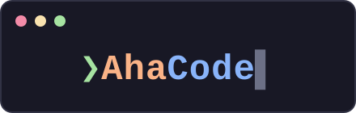

<div align="center">



**A terminal-native coding agent for local LLMs, built with [Textual](https://github.com/Textualize/textual).**

streaming chat · visible thinking · tool-using agent loop · plan mode · sub-agents · persistent sessions

[](https://www.python.org/)
[](https://github.com/Textualize/textual)
[](LICENSE)
[]()

[Features](#features) · [Getting started](#getting-started) · [Commands](#commands) · [Configuration](#configuration) · [Sessions](#sessions-on-disk) · [Architecture](#architecture) · [Development](#development)

</div>

---

> ⚠️ **Alpha.** AhaCode is under active development — expect rough edges and
> breaking changes between versions.

AhaCode talks to any OpenAI-compatible endpoint (vLLM, Ollama, gateways, …) and
renders the conversation in your terminal — with the model's reasoning streamed
live into a separate, dimmed bubble as it thinks, and its tool calls rendered as
foldable cards you approve before they run.

## Features

### Chat

- **Token-by-token streaming** in a responsive TUI — typing stays smooth while
  the model answers, and a new message cancels the previous stream.
- **Visible thinking** — reasoning deltas stream into their own foldable, dimmed
  block, which only appears for models that actually think and auto-collapses
  once the answer begins.
- **Multi-turn memory** — the full conversation history rides along with every
  request.
- **Markdown answers** — fenced code blocks are syntax-highlighted in place.
- **Smart auto-scroll** — follows the stream only while you are at the bottom;
  scrolling up to read is never interrupted.

### Agent

- **Tool-using agent loop** over native function calling: the model calls a tool,
  the result is fed back, and the loop runs until a turn arrives with no tool
  calls — with a turn cap that forces a tool-free wrap-up instead of truncating
  mid-task.

  | Tool | What it does | Asks first? |
  |---|---|---|
  | `read` | Read a file (paged with offset/limit) | — |
  | `glob` | Find files by path pattern, newest first | — |
  | `grep` | Search contents by regex → `path:line:text` | — |
  | `write` | Create or overwrite a file | ✅ |
  | `edit` | Replace a unique snippet, shown as a `-`/`+` diff | ✅ |
  | `bash` | Run a shell command in the project root | ✅ |
  | `todo_write` | Record the plan into the pinned checklist | — |
  | `task` | Delegate a subtask to a fresh sub-agent | ✅ |

- **Approval with a real preview** — side-effecting calls open a modal showing
  *what will happen*: the file content as highlighted code, the edit as a diff,
  the command as a command. Auto-approve is one toggle away for a trusted run.
- **A denylist below the approval** — catastrophic commands (`rm -rf /`, fork
  bombs, `mkfs`, `dd of=/dev/…`) are hard-blocked before they can even be
  offered, and each half of a chained command is checked separately. Defense in
  depth, not a guarantee — the human prompt is still the real safeguard.
- **Plan mode** — a read-only mode (`read`/`glob`/`grep`/`todo_write` only) where
  the model investigates and writes a plan into a pinned checklist instead of
  acting on it.
- **A plan gate** — when the model lays out a plan of three or more steps in act
  mode, the loop stops *between turns*, before any of it runs, and asks: run it
  step-by-step, or carry on in one session? The trigger is a tool call the model
  already makes, not a judgement about its own complexity — and the pause is a
  harness decision, not a prompt asking nicely. Continuing re-enters the very
  same loop, so nothing is redone. Threshold configurable; `0` turns it off.
- **`/run` executes that plan structurally** — each step is handed to its own
  fresh sub-agent, in order, with only the previous steps' concise *results*
  threaded forward, then one final pass combines them into a single answer.
  Splitting the work is a decision made by the harness, not by the model. It is
  execution, so it switches the session to act mode.
- **Sub-agents** — `task` spawns a child agent that renders into a nested,
  foldable 🤖 card and gets its own linked session file. Nesting depth is capped
  by config, a fan-out of tasks runs concurrently, and one process-wide gate
  bounds total requests so a single-GPU backend is never oversubscribed.
- **Thinking controls** — a per-turn reasoning budget (`/think`), and reasoning
  switched off on turns that only need to act on a tool result, which is what
  stops a multi-turn loop from spiralling.
- **Context compaction** — when a request approaches the model's window, the
  oldest stretch of the conversation is replaced by one summary and the newest
  turns are kept verbatim, with a note in the chat so nothing disappears
  silently. Two details make it safe: the trigger is the server's *own*
  `usage.prompt_tokens` rather than a guessed token count, and the cut can only
  land on a user turn — anywhere else would separate a `tool` message from the
  `assistant` tool_calls entry that introduced it, which an OpenAI-compatible
  server rejects outright. Your session file keeps the full, uncondensed
  transcript either way; only the request in flight is shortened.

### Sessions & config

- **Persistent sessions** — every message is appended to a plain-text JSONL
  file under `sessions/` in the project root; the latest session is restored
  on startup. Your history is always `cat`-able.
- **A session tree** — sub-agent transcripts are linked to the session that
  spawned them, and the picker shows the whole tree. Machine-authored child
  sessions open read-only, so you can read one without derailing it.
- **Model picker & status bar** — the bar under the prompt holds the mode,
  model, and auto-approve controls plus a live token/throughput readout; the
  model list is fetched from the server's `/v1/models`.

## Requirements

- Python 3.12+ and [uv](https://docs.astral.sh/uv/)
- An OpenAI-compatible LLM server (developed against a local
  [vLLM](https://github.com/vllm-project/vllm) instance)

## Getting started

```bash
git clone https://github.com/chycs7747/AhaCode && cd AhaCode
uv sync
uv run textual run ahacode.app
```

Type a message and press <kbd>Enter</kbd> — see [Keys](#keys) for the rest.

The first run creates `config.toml` in the project root — edit it to point at
your server, or configure it without leaving the chat (see [Commands](#commands)).

## Commands

Messages starting with `/` are handled locally — they never reach the model
and are not recorded in your session.

| Command | Effect |
|---|---|
| `/model` | Show the current model and endpoint |
| `/model <name>` | Switch model (persisted; the dropdown under the prompt does the same) |
| `/url <base_url>` | Switch endpoint (persisted) |
| `/think <n>` \| `/think off` | Per-turn reasoning budget in tokens |
| `/run` | Execute the current plan — each step in its own fresh sub-agent (switches to act) |
| `/new` | Start a new session |
| `/sessions` | Open the session tree and switch |
| `/help` | List available commands |

### Keys

| Key | Action |
|---|---|
| <kbd>Enter</kbd> | Send |
| <kbd>Shift</kbd>+<kbd>Enter</kbd> / <kbd>Alt</kbd>+<kbd>Enter</kbd> / <kbd>Ctrl</kbd>+<kbd>J</kbd> | Newline |
| <kbd>Esc</kbd> | Stop the turn in flight |
| <kbd>Ctrl</kbd>+<kbd>Y</kbd> | Copy the last answer (OSC 52 — works over SSH) |
| <kbd>y</kbd> / <kbd>n</kbd> | Approve / skip, in the approval modal |
| <kbd>Ctrl</kbd>+<kbd>D</kbd> | Quit |

> <kbd>Shift</kbd>+<kbd>Enter</kbd> needs a terminal that speaks the Kitty keyboard
> protocol (kitty, WezTerm, Ghostty, …) — historically a terminal sends the *same*
> bytes for <kbd>Enter</kbd> and <kbd>Shift</kbd>+<kbd>Enter</kbd>, so it cannot tell
> them apart. <kbd>Alt</kbd>+<kbd>Enter</kbd> and <kbd>Ctrl</kbd>+<kbd>J</kbd> work
> everywhere.

## Configuration

```toml
[model]
base_url = "http://127.0.0.1:8078/v1"
name = "qwen38-nvfp4"
api_key = "EMPTY"            # many local servers ignore this, but the SDK requires one
timeout = 60.0               # seconds; caps how long a read may block between chunks
thinking_token_budget = 4096 # per-turn reasoning cap; 0 = unbounded
reasoning_effort = "medium"  # low|medium|high|xhigh — a hint; effect is server-dependent
no_think_after_tools = true  # skip reasoning on turns that only act on a tool result

context_window = 32768       # your model's window, in tokens; 0 disables compaction

[agent]
subagent_depth = 1        # generations of sub-agents that may nest (0 = none)
max_parallel_agents = 8   # cap on concurrent requests across every agent
compact_threshold = 0.8   # condense once a request reaches this fraction of the window
keep_recent_messages = 6  # newest messages always kept verbatim
plan_gate_min_steps = 3   # ask before running a fresh plan of this many steps; 0 never asks
```

Both reasoning knobs are vendor extensions, so they are *hints*: a server without
a reasoning config simply refuses the budget, and AhaCode retries once without it
rather than failing every turn. `no_think_after_tools` is the one that matters most
in practice — a reasoning model re-deliberates on every turn of an agent loop, and a
per-turn budget only caps *one* turn, so the re-thinking stacks across a long loop.

## Sessions on disk

One session per file, one message per line, append-only:

```bash
ls sessions/
cat sessions/2026-08-18_212512.jsonl
tail -f sessions/*.jsonl   # watch messages land in real time
```

The first line of each file is a header — `{"type":"header","id","parent_id",
"kind","depth","model","title"}` — so a sub-agent's transcript points back at the
session that spawned it. The tree in the picker is derived by scanning those
headers; a parent never stores a child list, which keeps every write an append.

Both `config.toml` and `sessions/` are git-ignored — your key and your
conversations never end up in a commit.

## Architecture

Three layers, with one vocabulary between them:

```
ahacode/
├── app.py            # Textual App: layout, event wiring, worker → UI rendering
├── events.py         # the canonical event union every layer speaks
│                     #   ThinkingDelta · TextDelta · ToolCallDelta
│                     #   ToolCall · ToolResult · Notice · Usage
│
├── agent.py          # the agent loop: stream a turn → run its tools → feed the
│                     # results back → until a turn has no tool calls
├── context.py        # condense the history before it outgrows the window
├── subagent.py       # one delegated task as a fresh child loop (sub-agent-as-a-tool)
├── orchestrator.py   # /run: a plan's steps executed as sub-agents, in order
├── prompts.py        # system prompts, assembled per mode/model
├── render.py         # widget-free previews (diffs, syntax) shared by chat + modal
├── tools/
│   ├── base.py       #   the Tool contract (name · JSON Schema · execute)
│   ├── walk.py       #   shared traversal + skip rules for the search tools
│   ├── read.py glob.py grep.py write.py edit.py bash.py plan.py task.py
│   └── __init__.py   #   the registry, and the depth gate that hands out `task`
│
├── client.py         # LLM I/O — the only module that talks to a provider
├── config.py         # config.toml in the project root
├── session.py        # conversation state (plain Python, widget-free)
├── storage.py        # JSONL persistence + the session tree (./sessions/)
├── ahacode.tcss      # styles (no inline CSS)
└── widgets/          # one file per widget: chatbox, thinking, tool_result,
                      # subagent_card, todo_panel, plan_gate, approval_modal,
                      # model_bar, header_bar, prompt_input, session_picker
```

Design rules the codebase sticks to:

- **All LLM traffic goes through `client.py`.** The UI only ever sees the
  canonical events from `events.py`, so providers can be swapped without touching
  widgets. Provider quirks — which key reasoning deltas arrive under, the
  usage-only trailer chunk, tool-call arguments arriving as JSON fragments
  spread across chunks — are absorbed there.
- **The harness is widget-free.** `agent.run` reaches the UI only through an
  injected `emit` callback, and takes its stream, tool registry, and approval
  hook as arguments — so the whole agent loop is tested offline, without a
  terminal or a server.
- **Session state is a plain Python object** — testable without a terminal,
  serializable without ceremony.
- **UI is only touched from the main thread.** The worker hands events over via
  `call_from_thread` (built-in backpressure) and announces completion with a
  message, never by mutating shared state.
- **One file per tool and per widget**, styles in `.tcss`, never inline.

## Development

```bash
uv run pytest -q                        # unit + headless TUI tests (Textual Pilot)
uv run textual run --dev ahacode.app    # run with devtools attached
uv run textual console                  # live logs in a second terminal
```

Tests replace the LLM with an offline fake via `monkeypatch`, so the suite runs
without a server — including the TUI tests, which drive the real app through
Textual's `Pilot` (keystrokes in, mounted widgets out).

## Acknowledgments

AhaCode's design borrows ideas from some excellent open source projects:

- [Textual](https://github.com/Textualize/textual) — the TUI framework
- [elia](https://github.com/darrenburns/elia) — TUI chat architecture:
  worker-based streaming, pre-mounted bubbles, smart auto-scroll
- [Roo Code](https://github.com/RooCodeInc/Roo-Code) &
  [Kilo Code](https://github.com/Kilo-Org/kilocode) — agent-loop and
  provider-abstraction patterns

## License

[MIT](LICENSE)
